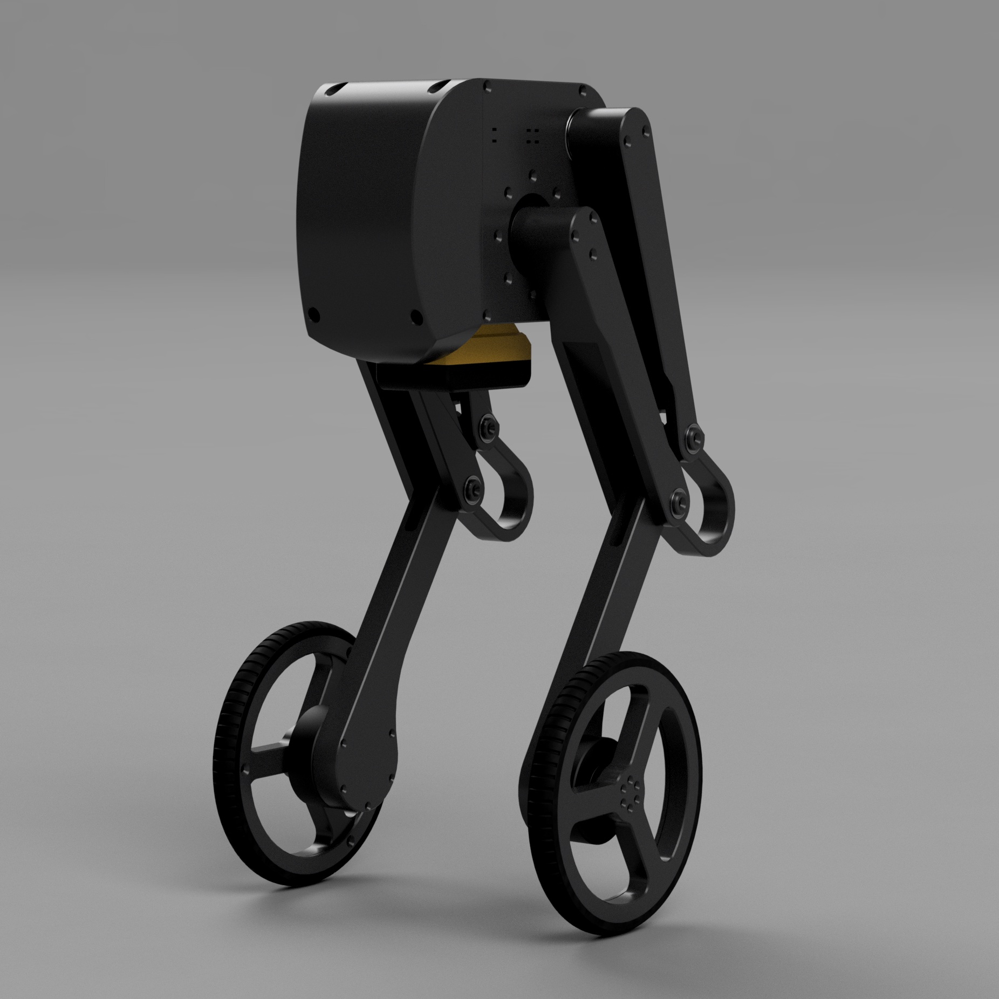

# Rhea wheeled biped robot

URDF model for the Rhea wheeled biped. 

If this is used with ROS2 Control on the physical robot, [pi3hat_hardware_interface](https://github.com/G-Levine/pi3hat_hardware_interface) is required.

The source for the meshes/URDF is contained in `urdf/rhea.blend`. This can be edited and re-exported using the [Phobos Blender plugin](https://github.com/dfki-ric/phobos).